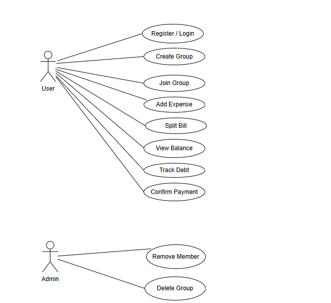
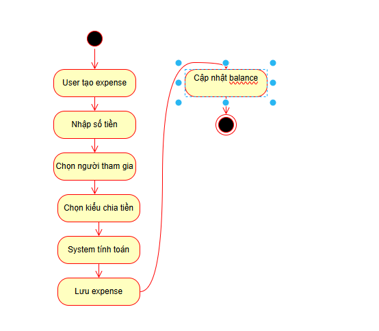

# 📊 Group Expense Management System (BA Project)

## 📌 Overview | Tổng quan
This project focuses on analyzing and designing a system to manage group expenses, split bills, and track debts efficiently.  
Dự án tập trung vào việc phân tích và thiết kế hệ thống quản lý chi tiêu nhóm, chia hóa đơn và theo dõi công nợ.

---

## 🎯 Objectives | Mục tiêu
- Automate expense tracking and bill splitting  
- Improve transparency in group financial activities  
- Reduce manual calculation errors  

- Tự động hóa việc theo dõi chi tiêu và chia hóa đơn  
- Tăng tính minh bạch trong các khoản chi nhóm  
- Giảm sai sót khi tính toán thủ công  

---

## 👨‍💼 My Role | Vai trò
**Business Analyst**

---

## 📋 Responsibilities | Công việc thực hiện
- Gathered and analyzed business requirements  
- Created UML diagrams (Use Case, Activity, Sequence)  
- Wrote user stories and functional specifications  
- Proposed solutions for expense tracking and debt management  

- Thu thập và phân tích yêu cầu nghiệp vụ  
- Xây dựng sơ đồ UML (Use Case, Activity, Sequence)  
- Viết User Story và tài liệu đặc tả chức năng  
- Đề xuất giải pháp cải thiện quản lý chi tiêu và công nợ  

---

## 🧩 System Features | Chức năng hệ thống
- Create and manage groups  
- Add and split expenses (equal, percentage, custom)  
- Track debts (who owes whom)  
- Confirm payments between users  

- Tạo và quản lý nhóm  
- Thêm và chia chi tiêu (chia đều, %, tùy chỉnh)  
- Theo dõi công nợ  
- Xác nhận thanh toán giữa các thành viên  

---

## 🛠️ Artifacts | Tài liệu BA
- 📄 Business Requirements Document (BRD)  
- 📊 UML Diagrams  
- 📝 User Stories  
---

## 📊 UML Diagrams

### Use Case Diagram

### Activity Diagram

### Sequence Diagram

---

## 📁 Project Structure | Cấu trúc thư mục
📁 group-expense-management-ba

┣ 📄 README.md

┣ 📄 BRD.pdf

┣ 📁 UML

┃ ┣ UseCase.png

┃ ┣ Activity.png

┃ ┗ Sequence.png

┣ 📁 UserStories

┃ ┗ user-stories.md
---

## 🔗 Related Resources | Liên kết
- 📄 BRD: [View BRD](./BRD.pdf)
- 💻 Source Code FE: https://github.com/trantuannam106/group-expense-management-FE
- 💻 Source Code BE: https://github.com/trantuannam106/group-expense-management-BE
---

## 🚀 Future Improvements | Hướng phát triển
- Add mobile application  
- Integrate online payment (MoMo, banking)  
- Advanced financial reports  

- Phát triển ứng dụng mobile  
- Tích hợp thanh toán online  
- Báo cáo tài chính nâng cao  

---

## 📬 Contact
- Video demo app lần 1:https://www.youtube.com/watch?v=XpGboMFir1A
- Email: tuannam106@gmail.com
